# **Echoes of the Abyss**

## **Introduction**

'Echoes of the Abyss' is a terminal-based, narrative driven horror game. The game blends classic survival horror elements with the interactive storytelling of a choose-your-own-adventure, creating a suspenseful experience where every decision affects your fate.

You play the part of an URBEX explorer and content creator who visits an abandoned research facility. The facility, once bustling with scientists and security personnel, is now eerily abandoned, its halls filled with the remnants of a hasty evacuation. The experiment was designed to study a mysterious and dangerous entity, but it broke free from containment, wreaking havoc on the facility. The few survivors sealed the creature in a containment room, but its intelligence and strength make it a constant threat. 

As the player, you must uncover the facility's dark secrets, avoid the lurking dangers, and find a way to escape before it's too late.

> **Note:** Please cmd-click (Mac) or ctrl-click (Windows) on any links to open them in a new tab.

Link to live website: 

[Echoes of the Abyss Live Site](https://echoes-of-the-abyss-8920634f42db.herokuapp.com/)

## How to Play:

The game will automatically print the title screen, displaying the welcome message as well as the commands that you, the player, can type at any time.
The commands include:

* 'map': Prints the map, showing your current location and available rooms.
* 'inventory': Lists the items you have collected.
* 'quit': Exits the game.
* 'help': Prints the available commands.

You will be periodically prompted to either type a command or press enter to progress with the story. 
The first room you will experience is the 'entry room'. From here, your journey begins. You can interact with objects, add items to your inventory, and/progress to a new room.

Each room has unique items to be interacted with or collected. You can revisit rooms, and experience multiple endings.

Enjoy!

&nbsp;
## UX
### User Stories

As a user...
* I want to play a game with multiple paths and endings.
* I want a game that I can play in a relatively short amount of time.
* I want to play a game that is suspenseful and interesting.
* I want to play a game that has consequences and that requires critical thinking skills.
* I want to play a game that is intuitive, giving help when I need, or letting me exit.

As a developer...
* I want to create a game with multiple possible storylines.
* I want to create an interactive game that allows players to learn the game lore and build an inventory.
* I want there to be consequences if a player doesn't collect the correct items.
* I want to create a game that's replayable without being boring.
* I want to create a game that is quick enough to progress through if the player dies and wants to try again.
* I want the player to be able to access different commands to allow for a comfortable gamining experience.

### Opportunities

| Opportunities | Importance | Viability/Feasibility |
|-----|:-----:|:-----:|
| Create multiple endings | 4 | 5 |
| Each room adds to game lore | 2 | 3 |
| Branching storylines | 4 | 4 |
| Character development | 2 | 3 |
| Inventory system | 5 | 5 |
| Puzzles | 2 | 2 |
| Time-sensitive decisions | 2 | 2 |
| Hint keyword | 1 | 1 |

The opportunites available in this project were endless, and narrowing them down was a challenge. Due to time constraints, I decided to build a branching story that is fairly linear, as only one room triggers the ending sequences.
More details about features I'd love to add can be found in 'Future Developments'.

&nbsp;
## Development

### Planning

Once the important and feasibile opportunties were established, I began planning. I created a map first, wanting to limit this version of the story to nine rooms. I generated the story with ChatGPT, asking it to include items to interact with and collect, as well as endings related to the final room.

From there, I began mapping out my game with LucidChart. A screenshot of the game logic can be seen below, followed by a breakdown. 

### Game Tree Structure

### Game Tree Breakdown
**Room 1: Entry Hall**
    
    Actions:

    - Look behind the desk: Move to Room 2: Observation Chamber.
    - Move to Observation Chamber: Move to Room 2: Observation Chamber.
    - Move to Office: Move to Room 4: Office.

**Room 2: Observation Chamber**

    Actions:

    - Pick up syringe: Add the Syringe to the inventory.
    - Look behind mirror: Trigger an event (not detailed in the diagram).
    - Move to Storage Closet: Move to Room 3: Storage Closet (only if the player has the key in their inventory).
    - Move to Laboratory: Move to Room 5: Laboratory.
    - Return to Entry Hall: Move back to Room 1: Entry Hall.

**Room 3: Storage Closet (Accessible with Key)**

    Actions:

    - Examine notebook: Explore and gain possible clues.
    - Pick up crowbar: Add the Crowbar to the inventory.
    - Pick up toolbox items: Add the Toolbox items to the inventory.
    - Move to Morgue: Move to Room 6: Morgue.
    - Move to Observation Chamber: Move back to Room 2: Observation Chamber.

**Room 4: Office**

    Actions:

    - Look at logbook: Read the logbook for clues or story progression.
    - Examine computers: Possibly gain more information or trigger an event.
    - Move to Break Room: Move to Room 7: Break Room.
    - Move to Laboratory: Move to Room 5: Laboratory.
    - Return to Entry Hall: Move back to Room 1: Entry Hall.

**Room 5: Laboratory**

    Actions:

    - Examine equipment: Possibly gain information or story progression.
    - - Pick up key: Add the Key to the inventory.
    - Move to Morgue: Move to Room 6: Morgue.
    - Move to Observation Chamber: Move back to Room 2: Observation Chamber.
    - Move to Containment Room: Move to Room 9: Containment Room (if you have the keycard in your inventory).
    - Return to Office: Move back to Room 4: Office.

**Room 6: Morgue**

    Actions:

    - Pick up crowbar: Add the Crowbar to the inventory.
    - Examine lab coat: Possibly gain a keycard or additional information.
    - Move to Laboratory: Move back to Room 5: Laboratory.
    - Move to Containment Room: Move to Room 9: Containment Room (if you have the keycard in your inventory).

**Room 7: Break Room**

    Actions:

    - Take energy drink: Add the Energy Drink to the inventory.
    - Pick up knife: Add the Knife to the inventory.
    - Move to Office: Move back to Room 4: Office.
    - Move to Security Room: Move to Room 8: Security Room.

**Room 8: Security Room**

    Actions:

    - Read logs: Gain clues or trigger an event.
    - Move to Laboratory: Move back to Room 5: Laboratory.
    - Move to Containment Room: Move to Room 9: Containment Room (if you have the keycard in your inventory).
    - Move to Morgue: Move back to Room 6: Morgue.
    - Move to Break Room: Move back to Room 7: Break Room.

**Room 9: Containment Room**

    Actions:

    - Inspect glass enclosure: Trigger an event or reveal information.
    - Examine control panel: Possibly solve a puzzle or gain clues.
    - Move to Security Room: Move back to Room 8: Security Room.
    - Move to Morgue: Move back to Room 6: Morgue.

**Ending Sequence**

    Upon reaching the Encounter (Ending Sequence), the player's fate depends on the items they have in their inventory:

    - Run: 
      Player's fate is determined by their ability to enter the correct room sequence.

    - Use Crowbar:
      If the player has no crowbar in their inventory, they die.
      If the player has a crowbar, they escape.

    - Use Syringe:
      If the player has no syringe in their inventory, they die.
      If the player has a syringe, they escape.

    - Accept Fate: 
      The player dies.

    The sequence of entering rooms also impacts the outcome:

        Enter correct room sequence & escape.
        Enter incorrect room sequence & die.

    The game includes multiple possible endings depending on the player's choices and the items they have gathered:

        Escape (via correct room sequence, crowbar, or syringe).
        Death (via incorrect choices or lacking essential items).

&nbsp;        
### File Organisation
Within this project are four Python files. 

#### 1. run.py
This file holds the main game functions, or the room functions. These functions act at starting points from which a player can progress through the story and make certain chices.

#### 2. helper_functions.py
This file holds functions that add to the player's experience. It is linked to the other python files and facilitates a more enjoyable experience for the user. 

#### 3. choices_functions.py
This file holds the functions that will be called if the player types in an object key word. Anythng that is interactable has its function here, and allows the player to learn more about the lore, interact with an item, or add an item to their inventory.

#### 4. ending_sequences.py
This file is only called in when the player reaches the Observation Room, Room 9. There are 7 possible endings in this file.

&nbsp;
## Features

### The Title Screen
The title screen prints the title of the game, but also the command keywords the user can type in throughout the game.

### Back Story
The back story gives some context to the game and explains why you are there in the first place (and why you would continue to stay).

### Room Functions
Each room has it's own function equally named, and is repsonsible for printing the readable content. From here, the player will enter in their choice from the choices/keywords, and can progress from there.

### Navigating Through the Game: User Input

After each text paragraph, and other regular intervals, a prompt will appear through which the player can choose to enter certain commands. 
These commands vary from function to function, but there are some constants. All commands can be entered in upper or lower case.

#### User Commands

Players can input user commands whenever an input is posspromptedible. They can enter them in lower or upper case.

* MAP: Displays the facility map.
* INVENTORY: Displays the current inventory.
* HELP: Displays the list of available commands.
* QUIT: Exits the game.

#### Choices

The choices functions account for both inventory items and items that introduce lore. Choices vary from room to room, with some rooms only being accessible if a certain item is in the player's inventory. 

&nbsp;
### Data Model
Throughout this project, I opted for a function-oriented program with the functions divided into relevant files. A copy of the summary of the four python files, previously seen in the planning section, can be seen below:

#### 1. run.py
This file holds the main game functions, or the room functions. These functions act at starting points from which a player can progress through the story and make certain chices.

#### 2. helper_functions.py
This file holds functions that add to the player's experience. It is linked to the other python files and facilitates a more enjoyable experience for the user. 

#### 3. choices_functions.py
This file holds the functions that will be called if the player types in an object key word. Anythng that is interactable has its function here, and allows the player to learn more about the lore, interact with an item, or add an item to their inventory.

#### 4. ending_sequences.py
This file is only called in when the player reaches the Observation Room, Room 9. There are 7 possible endings in this file.

&nbsp;
## Future Developments

As I mentioned before, there were an endless amount of opportunites to build and incorporate into this game. Sadly, I didn't have enough time to add all the features I would like, so below is a (long) list of additional changes and features I would like to make:

* I would like to create more interable objects to give the player the chance to learn more about the scientists, facility and the entity.

* I would like to create more endings, as only one rom at the moment triggers the ending sequences. I would like to create some novelty endings like 'falling through a hole', or 'electrocution'.

* I would like to create an achievements system, which can be printed at the end of the game when the player lives/dies. For example, letting them start from a certain point in the game to achieve a different ending.

* I want to create more inventory items, all with specific uses throughout the game. Some items currently don't have a function tied to the ending.

* I want to create a restricted inventory, forcing the plater to drop items if it's full, in turn affecting their survival.

* I want to include puzzles to increase interactivity and enocurage the player to interact with as many obejcts as possible.

* I want to create a summary of the player's pathing, allowing them to see what rooms the visited and in what order. 

* I want the room functions to update to remove items already collected and inform the player that they've already been there. 

* I would like the energy drink to play a bigger part after being consumed. For example, an ending where the player gets sick, or is too caffeinated to pay attention and dies somehow. 

* I would also like to add multiple levels, but this would require some restructuring as it would get very text-heavy if kept in the current format.

* Add character backstory.

&nbsp;
## Testing

The following is a chart I used to record the results of the manual quality test for all functions. The test included testing that the function worked in isolation, was called correctly within another function, and that the program continued to run smoothly.

Once I completed my code, I used [autopep8](https://pypi.org/project/autopep8/) to format it.

### Manual Testing Results Table

| Function Name | Choice | Working: Y / N |
|-----|:-----:|:-----:|
| Title screen | - | Y |
| Back story | - | Y |
| Add to inventory | - | Y |
| Room 1: Entry Hall | Look behind the desk. | Y |
|  | Move to Observation Chamber. | Y |
|  | Move to Office. | Y |
| Room 2 : Observation Chamber |  | Y |
|  | Pick up syringe. | Y |
|  | Look behind mirror. | Y |
|  | Move to Storage Closet. | Y |
|  | Move to Laboratory. | Y |
|  | Return to Entry Hall. | Y |
| Room 3: Storage Closet |  | Y |
|  | Examine notebook. | Y |
|  | Pick up crowbar. | Y |
|  | Pick up toolbox item. | Y |
|  | Move to Morgue. | Y |
|  | Move to Observation Chamber. | Y |
| Room 4: Office |  | Y |
|  | Look at logbook. | Y |
|  | Examine computers. | Y |
|  | Move to Break Room. | Y |
|  | Move to Laboratory. | Y |
|  | Return to Entry Hall. | Y |
| Room 5: Laboratory |  | Y |
|  | Examine equipment. | Y |
|  | Pick up key. | Y |
|  | Move to Morgue. | Y |
|  | Move to Observation Chamber. | Y |
|  | Move to Containment Room. | Y|
|  | Return to Office | Y |
| Room 6: Morgue |  | Y |
|  | Pick up crowbar. | Y |
|  | Examine lab coat. | Y |
|  | Move to Laboratory. | Y |
|  | Move to Containment Room. | Y |
| Room 7: Break Room |  | Y |
|  | Take energy drink. | Y |
|  | Pick up knife. | Y |
|  | Move to Office. | Y |
|  | Move to Security Room. | Y |
| Room 8: Security Room |  | Y |
|  | Read logs. | Y |
|  | Move to Laboratory. | Y |
|  | Move to Containment Room. | Y |
|  | Move to Morgue. | Y |
|  | Move to Break Room. | Y |
| Room 9: Containment Room |  | Y |
|  | Inspect glass enclosure. | Y |
|  | Examine control panel. | Y |
|  | Move to Security Room. | Y |
|  | Move to Morgue. | Y |
| Ending Sequence |  | Y |
|  | Run. | Y |
|  | Use crowbar. | Y |
|  | Use syringe. | Y |
|  | Accept fate. | Y |
| User Commands |  | Y |
|  | MAP | Y |
|  | INVENTORY | Y |
|  | press enter | Y |
|  | QUIT | Y |
|  | HELP | Y |

&nbsp;
### Error Handling

Each input statement can receive a keyword from the player. The keyword will then be compared against the options by using a while loop. IF the keyword is valid, the appropriate action will be executed (add item to inventory, display contnet, move room, etc). If the keyword is invalid, an error will print informing the player of this, and will reprint the input prompt allowing them to try again.

This check also applies to the inventory items. Duplicate items cannot be added. If a player tires to add an item a second time, an error message will print informing them it is already in their inventory.

Each input prompt has a set of values it will accept. It will not punish a player for inputting something invalid, and will display an error messafe. The only exception is in the 'run' ending sequence. If the player inputs the wrong numbers, it will result in the player's death. It will not however accept invalid answers in the wrong format.

&nbsp;
### Bugs and Fixes

Below is a summary of the bigs I encountered during development and through testing.

| Issue | Details | Fix |
|-----|:-----:|:-----:|
| 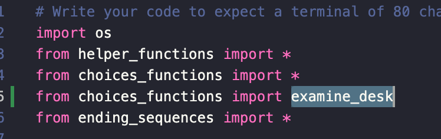 | Wasn't being called and resulted in error printing. | Was explicitly imported, later functions were refactored. Explicit import remove and function worked normally. |
| 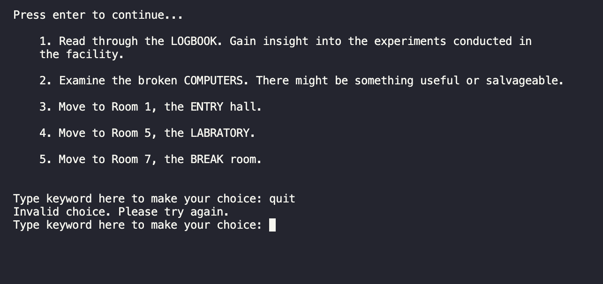 | Incorrect call. | Changed helper_function file to use dot notation. |
| 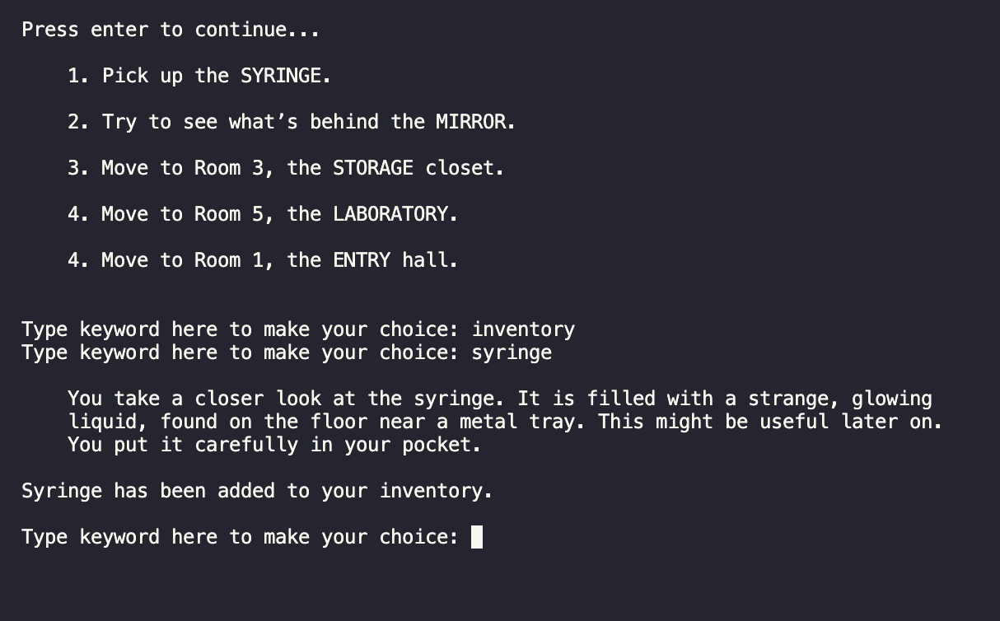 | Item was added to inventory, but display inventory was not being called. | Fixed by adding helper dot notation. |
| 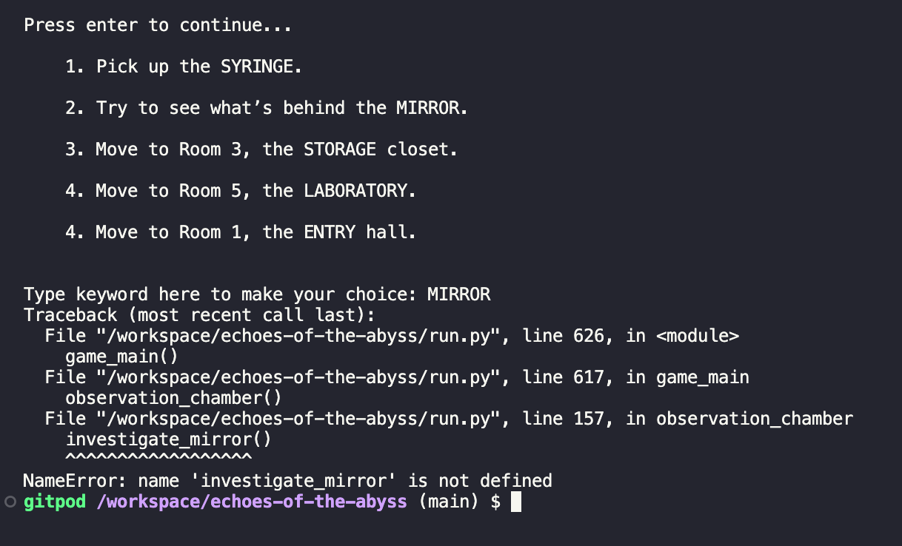 | Wasn't being called and resulted in error printing. | Was explicitly imported, later functions were refactored. Explicit import remove and function worked normally. |
| 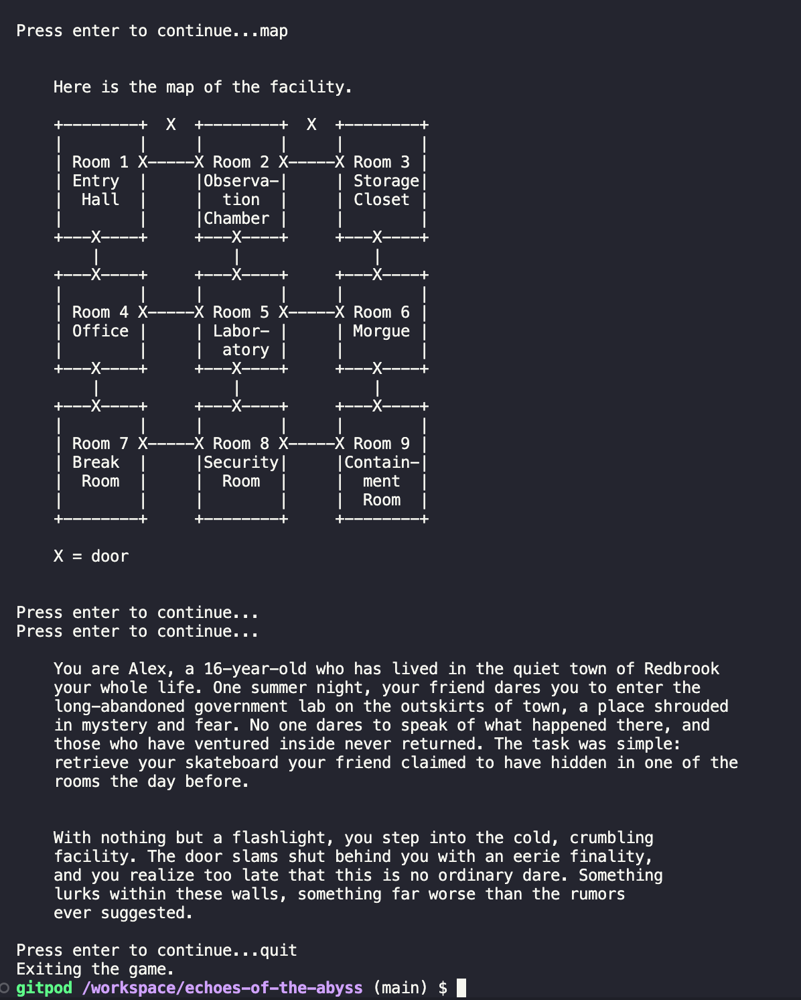 | Functions weren't being called. | Added functions to user_commands and added dot notation. |
| 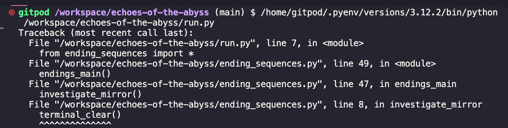 | Not being imported correctly. | Added helper dot notation. |
| 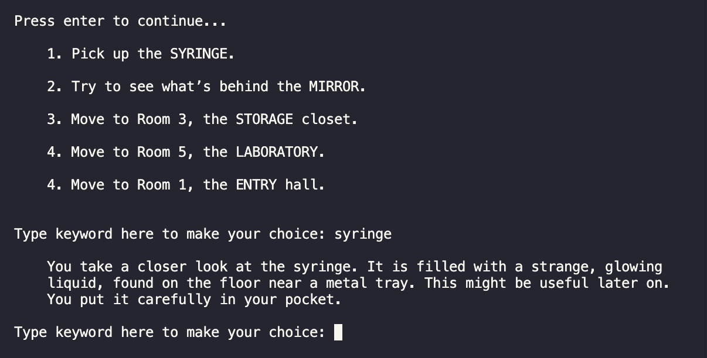 | While loop was breaking after item was added to inventory. | Removed break following inventory items to allow player's to access other options. |
| 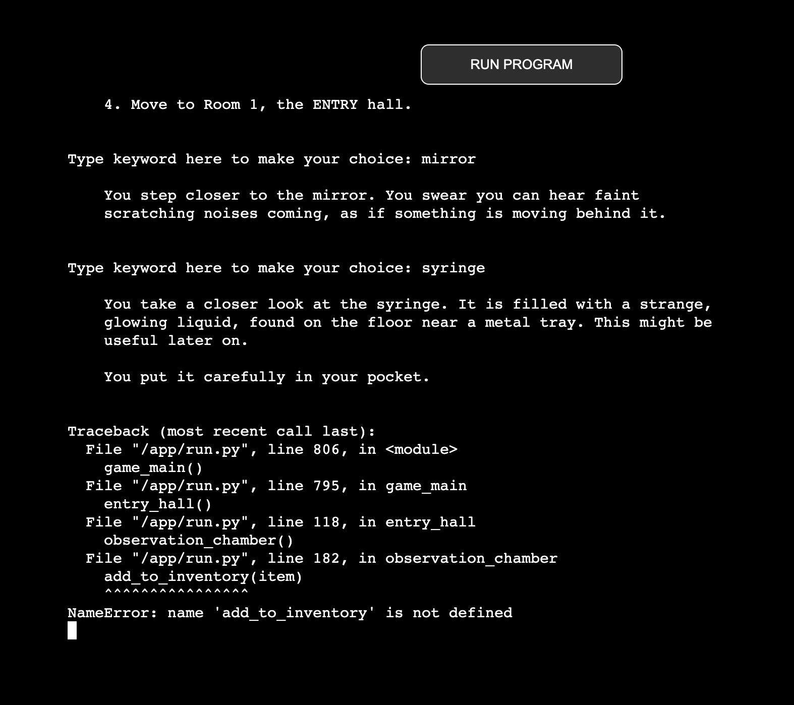 | Not being imported and called properly | Added helper dot notation. |

&nbsp;
### Post Development Testing

#### Python/PEP8 Testing

Once inital testing had been done, I used Code Institute's [Python Linter](https://pep8ci.herokuapp.com/).

I received the following error:

    'E501 line too long (X > X characters)'

This error was occassionally raised across all files due to the length the some strings. The highlighted lines featured a line in the 'help' prompt. This error, however, counts the empty spaces/indents as character. After checking each error and comparing it to the GitPod version, each line was under 79 characters and easily fit in the terminal on the live site. 

1. run.py Linter Check Results.

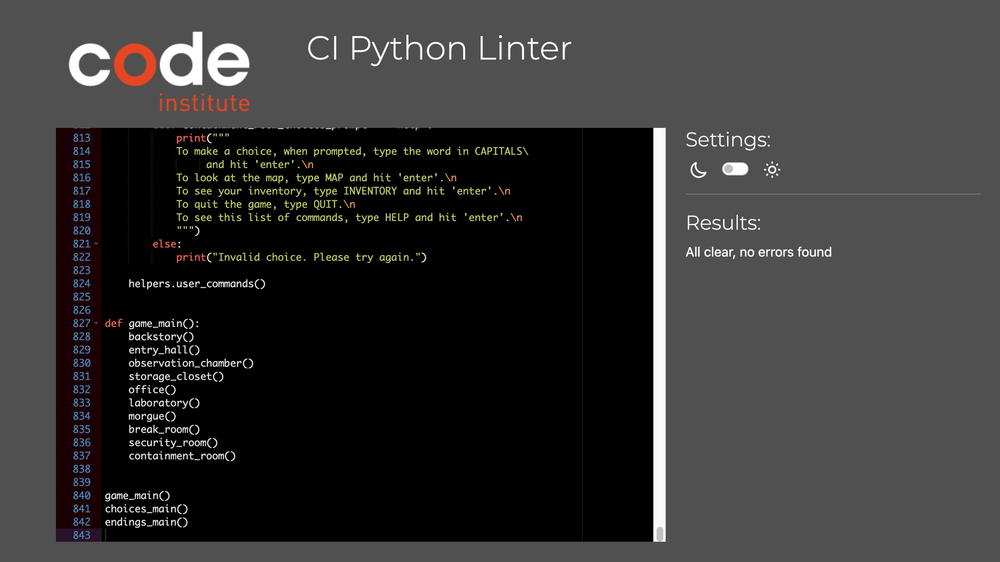

2. choice_functions.py Linter Check Results.

3. ending_sequences.py Linter Check Results.

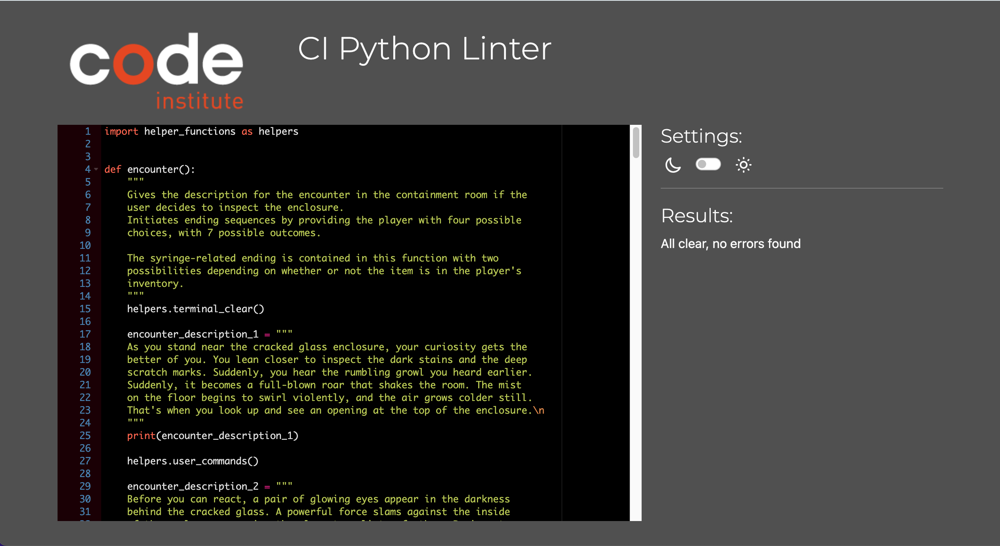

4. helper_functions.py Linter Check Results.

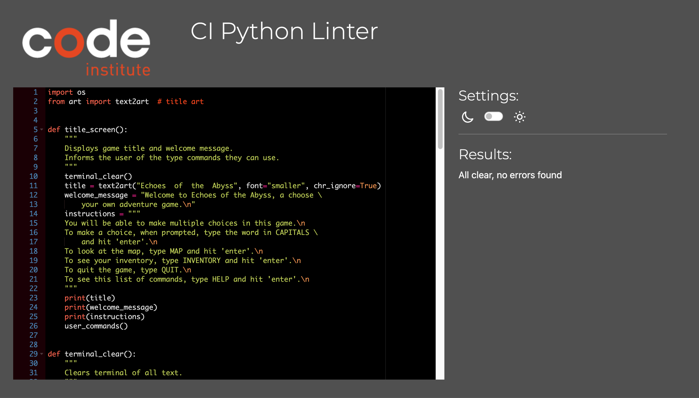

#### HTML & CSS Testing
As I added some custom styling to this template, I ran the code through W3 checker.

## Deployment

Before deploying, I checked two things:
1. Is my requirements.txt up to date?
2. Have I pushed all pending changes to my GitHub repository?

Below are the steps I followed for deployment once I did the above:

1. Sign in to Heroku.
2. Navigate to your dashbord.
3. In the top right corner, click 'New'.
4. Click 'Create new app'.
5. Give your app a name and choose a region. Click 'save'.
6. Move to the settings tab.
7. Scroll down to 'buildpacks'.
8. Add Python, then JSON (in that order). Save changes.
9. Move to the deploy tab. 
10. Select GitHub and search for the repository name.
11. Choose between automatic or manual deploys. (I chose manual.)
12. Click deploy branch.
13. Wait for success message. 
(14. Follow link to live site.)

## Credits
### Content

* Terminal/live site template from Code Institute. 

* Storyline created by [ChatGPT](https://openai.com/chatgpt/).

* Background image from Adobe Stock. [Link to image used.](https://stock.adobe.com/ie/search/free?filters%5Bcontent_type%3Aphoto%5D=1&filters%5Bcontent_type%3Aillustration%5D=1&filters%5Bcontent_type%3Azip_vector%5D=1&filters%5Bcontent_type%3Aimage%5D=1&filters%5Borientation%5D=horizontal&filters%5Bcontent_type%3A3d%5D=0&filters%5Bcontent_type%3Atemplate%5D=0&filters%5Bcontent_type%3Avideo%5D=0&filters%5Bfree_collection%5D=1&filters%5Border%5D=relevance&k=glitch&order=relevance&safe_search=1&limit=100&search_page=1&search_type=asset-type-change&acp=&aco=glitch&get_facets=1&asset_id=248081843)

* [text2art](https://pypi.org/project/art/) / art 6.1 from pypi.

* [utils](https://pypi.org/project/utils/) 1.0.2 from pypi.

* Favicon sourced from [loading.io](https://file.loading.io/resources/icon/kpp0bq.svg?v=1) under [loading.io BY License](https://loading.io/license/#by-license).

* [autopep8](https://pypi.org/project/autopep8/) for code strucutring.

* [LucidChart](https://lucid.app/lucidchart/ab90e1dd-8762-4d4f-80d7-7b74bf9fbeb4/edit?invitationId=inv_40e4ed57-e5f2-4ac5-9a5c-2a17065440a2&page=0_0#) to make the tree chart displaying all possible game paths.

* Background image from [freepik.com](https://www.freepik.com/free-photo/black-glitch-effect-digital-noise-texture-background_15599962.htm#query=glitch%20background&position=2&from_view=keyword&track=ais_hybrid&uuid=226904e6-aa58-4dc3-8d69-fb3838029595)

### Testing Resources
The following were used for testing (during and after development):

* [Code Institute Python Linter.](https://pep8ci.herokuapp.com/)

* GitPod terminal.

### Additional Resources
Below is a list of additional resources I used to help build my game.

* [Python Basic Data Analysis](https://libguides.ntu.edu.sg/python/input#:~:text=The%20input%20function,-The%20input%20function&text=In%20Python%2C%20we%20request%20user%20input%20using%20the%20input()%20function.&text=This%20set%20of%20code%20is,math%20operators%20like%20addition%20%2F%20subtraction).

* Enumrate() by [geeksforgeeks.com](https://www.geeksforgeeks.org/enumerate-in-python/).